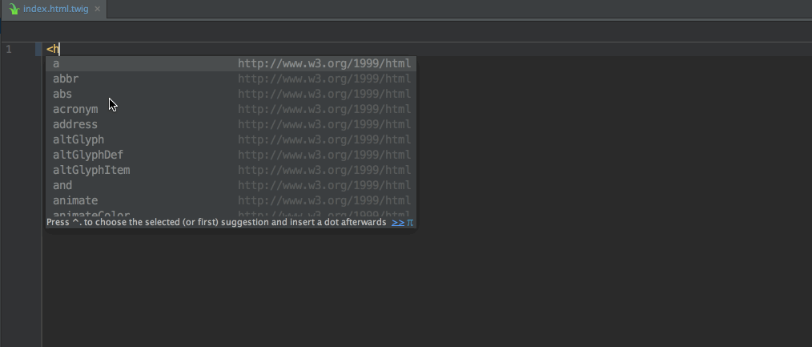

Hodor plugin for PHPStorm

A PHPStorm plugin containing Hodor live templates.

### Three easy steps to install

To install the plugin, open PHPStorm and

1) Open "File > Settings > Plugins" and click on the "Browse repositories" button.
2) Search for "Hodor" and install the plugin
3) Restart PHPStorm
